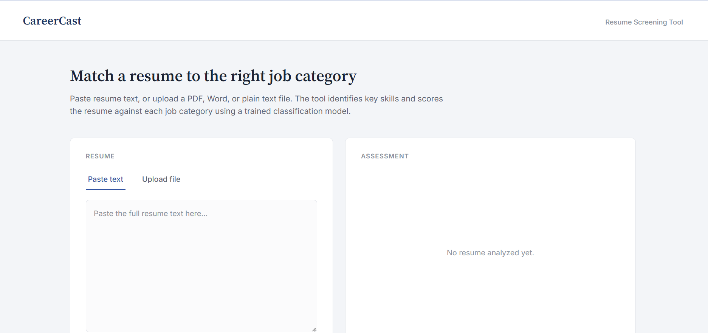
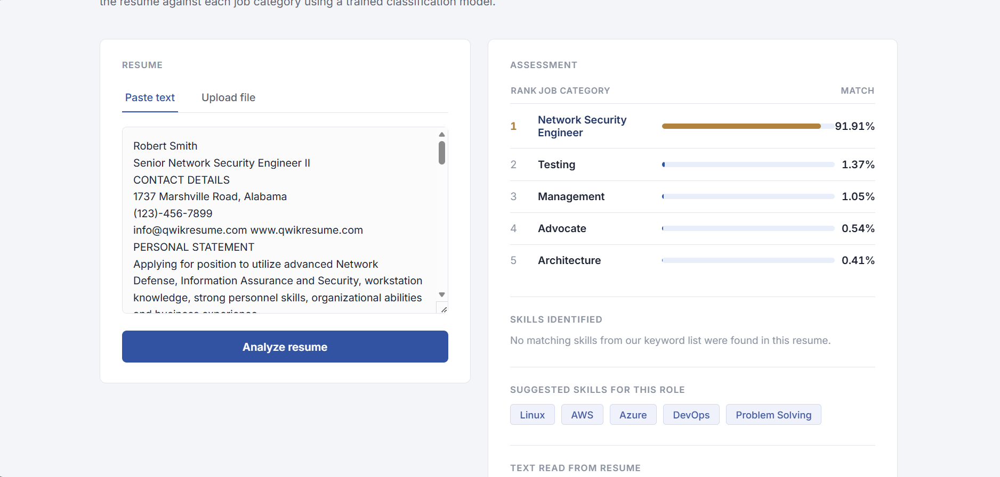
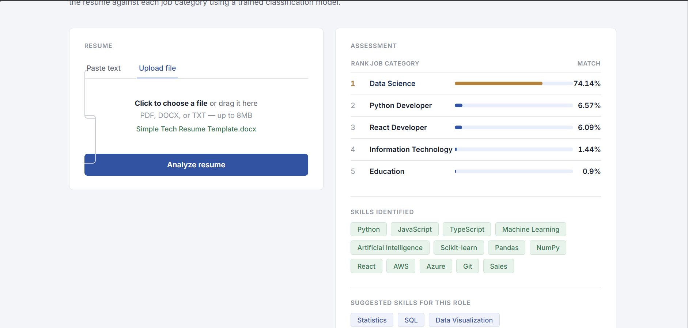

# CareerCast — AI-Powered Career Intelligence Platform

CareerCast matches a resume against a set of job categories using a trained
Logistic Regression classifier. Paste resume text or upload a **PDF / DOCX /
TXT** file, and get back the top matching job categories with confidence
scores, along with identified skills and role-specific skill suggestions.

**Live demo:**https://ai-powered-career-intelligence-plat-eta.vercel.app/

---

## Screenshots

**Home screen**



**Pasted resume text — ranked job matches, identified skills, and suggested skills**



**File upload — DOCX resume analyzed with skills breakdown**



---

# CareerCast — Resume → Suitable Job Web App

A Flask web app that predicts suitable job roles from a resume. Paste resume
text or upload a PDF / DOCX / TXT file, and the app returns a ranked list of
job categories with match percentages.

The app ships with **two independent classifiers**, kept fully separate so
their results are never mixed:

| | Broad model | Narrow model |
|---|---|---|
| **Algorithm** | Logistic Regression | Random Forest + XGBoost (ensemble) |
| **Categories** | Full label set (see `train_model.py`) | 3 categories only: Java Developer, Business Analyst, Project Manager |
| **Endpoint** | `POST /api/predict` | `POST /api/predict_narrow` |
| **Model file(s)** | `resume_job_classifier.joblib` | `rf_model.joblib`, `xgb_model.json`, `tfidf_vectorizer.joblib`, `label_encoder.joblib` |
| **Loader** | `app.py` (inline) | `narrow_model.py` |

The narrow model was trained separately on a smaller, hand-labeled dataset
and is intentionally kept out of the broad model's category list — the two
never blend their predictions.

---

## Project structure

```
.
├── app.py                     # Flask app: routes, text extraction, LR model loading
├── narrow_model.py            # Loader + predictor for the RF/XGBoost narrow classifier
├── train_model.py             # Training script for the broad LR model
├── resume_job_classifier.joblib   # Trained broad LR model
├── rf_model.joblib             # Trained narrow Random Forest model
├── xgb_model.json              # Trained narrow XGBoost model (native XGBoost format)
├── tfidf_vectorizer.joblib     # TF-IDF vectorizer for the narrow model
├── label_encoder.joblib        # Label encoder for the narrow model's 3 categories
├── templates/
│   └── index.html
├── nltk_data/                  # Bundled NLTK data (stopwords, wordnet)
├── requirements.txt
└── vercel.json
```

> **Note:** the raw resume dataset used to train the narrow classifier is
> **not included** in this repo (it contains real people's names and
> contact details). Only the trained model artifacts are committed.

---

## Run locally

1. Install dependencies:
   ```bash
   pip install -r requirements.txt
   ```
2. Make sure these files sit next to `app.py`:
   - `resume_job_classifier.joblib` (broad model — see `train_model.py` for training)
   - `rf_model.joblib`, `xgb_model.json`, `tfidf_vectorizer.joblib`, `label_encoder.joblib` (narrow model)
3. Start the server:
   ```bash
   python app.py
   ```
4. Open [http://localhost:5000](http://localhost:5000)

If a model file is missing, its endpoint will return a clear JSON error
(`model not loaded`) instead of crashing the app — the other model keeps
working independently.

---

## API

### `POST /api/predict` — broad model (Logistic Regression)

Form data:
- `resume_file` — PDF / DOCX / TXT upload, **or**
- `resume_text` — pasted resume text

Response:
```json
{
  "results": [{"role": "...", "confidence": 0.83}, ...],
  "preview": "...",
  "skills": ["Python", "SQL", ...]
}
```

### `POST /api/predict_narrow` — narrow model (Random Forest / XGBoost)

Form data:
- `resume_file` — PDF / DOCX / TXT upload, **or**
- `resume_text` — pasted resume text
- `model` — optional: `"rf"`, `"xgb"`, or `"ensemble"` (default: `"ensemble"`, averages both)

Response:
```json
{
  "results": [{"role": "Java Developer", "confidence": 0.91}, ...],
  "model": "ensemble",
  "categories": ["Java Developer", "Business Analyst", "Project Manager"]
}
```

Only recognizes the 3 categories listed above — resumes for other roles
will still return a best-effort ranking among those 3, so this endpoint is
best used when you specifically want that narrower classification.

---

## Tech stack

- **Backend:** Flask
- **Models:** scikit-learn (Logistic Regression, Random Forest), XGBoost
- **Text processing:** NLTK (stopword removal, lemmatization), regex cleaning
- **File parsing:** PDF / DOCX / TXT resume extraction
- **Deployment:** Vercel (see `vercel.json`)

---

## Notes on the narrow classifier

- Trained on a smaller, hand-labeled resume set covering only 3 job titles.
- RF and XGBoost predictions are aligned to a fixed category order before
  ensembling, so their class indices can't silently mismatch.
- `xgb_model.json` is loaded via XGBoost's native `load_model()` API (not
  `joblib`), since it was saved in XGBoost's own JSON format.
